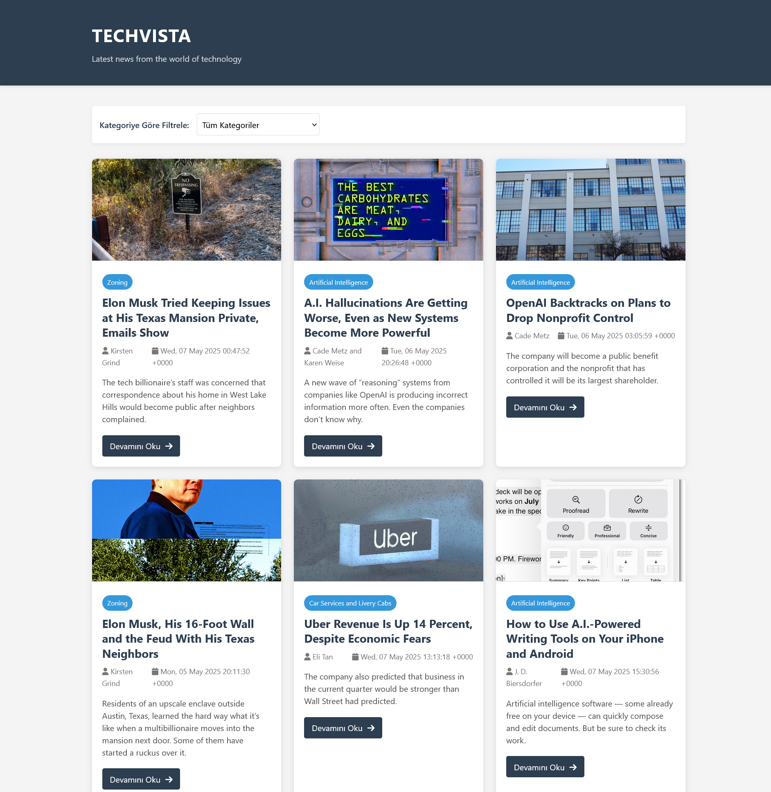
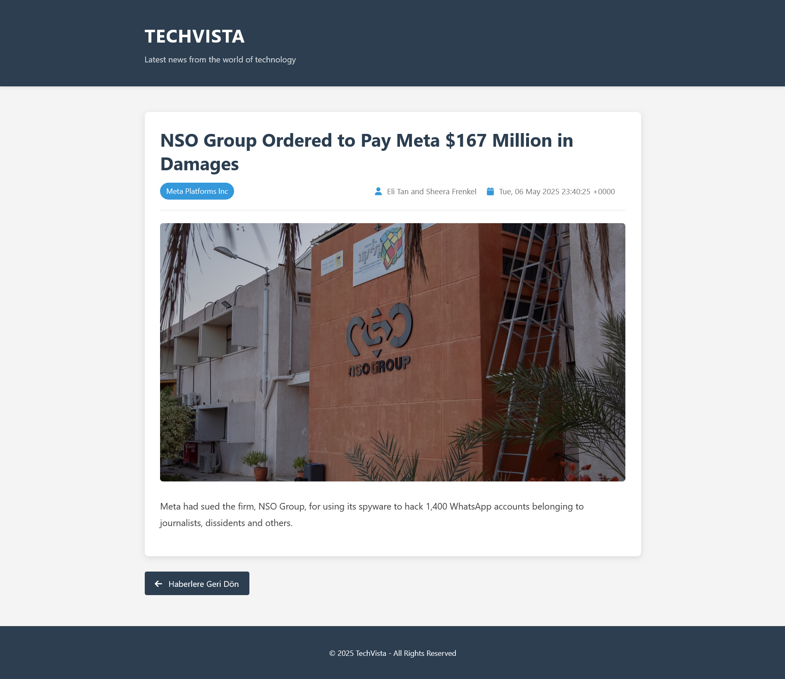

# 📰 ASP.NET RSS News Aggregator

This is a web application built with **ASP.NET Web Forms** that automatically fetches technology news from the **New York Times RSS feed**, stores it in an **Access database**, and displays it with category filtering and detail views.

---

## 🚀 Features

- Fetches news from NYT Technology RSS
- Saves to Access database (`.accdb`)
- Prevents duplicate entries by title
- Displays news with category filtering
- Detail view for individual news items
- Uses Session for temporary storage
- Error logging with NLog (`log.txt`)

---

## 📸 Screenshots

### 🏠 Home Page (`Home.aspx`)

> Displays all saved news with category filtering and links to full details.

---

### 📄 News Detail Page (`NewsDetail.aspx`)

> Displays complete information about a selected news article.

---

## ⚙️ Installation

1. Clone this repository into Visual Studio.
2. Install the **NLog** package via NuGet:
